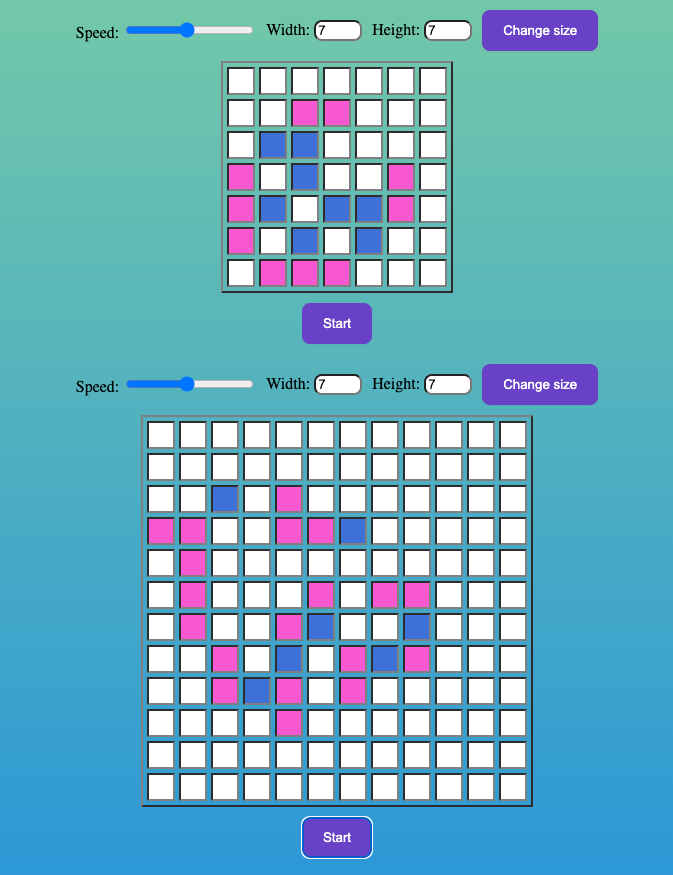

<div align="center">
  <h1><code>Game of life</code></h1>

<strong>Game of Life built in Typescript</strong>

  <p>
  <a href=""></a>
    
  </p>

_**[Deployed here](https://dmitrygvl.github.io/gameOfLife/)**_

## </div>

## Table of Contents

- [About](#about)
  - [Built with](#built-with)
  - [Rules](#rules)
- [Getting Started](#getting-started)
  - [Prerequisites](#prerequisites)
  - [Installing](#installing)
- [Usage examples](#usage-examples)
- [License](#license)

## About <a name="about"></a>

This project was inspired by **[The Game of Life](https://en.wikipedia.org/wiki/Conway%27s_Game_of_Life)** created by _John Horton Conway_.  
No players are needed for this game. Just create a pattern and you are ready to go! 🤗

<div align="center">
  
</div>

### Built with <a name="built-with"></a>

<p align="center"><a href="https://babeljs.io/" target="_blank">
   </a> <a href="https://www.w3schools.com/css/" target="_blank"> 
   </a> <a href="https://git-scm.com/" target="_blank"> 
   </a> <a href="https://www.typescriptlang.org/" target="_blank"> 
   </a> <a href="https://jestjs.io" target="_blank"> 
   </a> <a href="https://eslint.org/" target="_blank"> 
   </a>
</p>

### Rules <a name="rules"></a>

1. Any live cell with fewer than two live neighbours dies, as if by underpopulation.
2. Any live cell with two or three live neighbours lives on to the next generation.
3. Any live cell with more than three live neighbours dies, as if by overpopulation.
4. Any dead cell with exactly three live neighbours becomes a live cell, as if by reproduction.

Highlighting of cells that, being alive, must die in the next generation (dead - white, living - pink, doomed to death - blue).

These rules, which compare the behavior of the automaton to real life, can be condensed into the following:

1. Any live cell with two or three live neighbours survives.
2. Any dead cell with three live neighbours becomes a live cell.
3. All other live cells die in the next generation. Similarly, all other dead cells stay dead.

## Getting started <a name="getting-started"></a>

### Prerequisites <a name="prerequisites"></a>

:warning: Before installing the project latest version of **npm** should be installed.

```
npm install -g npm@latest
```

### Installing <a name="installing"></a>

1. Clone the repo

```
git clone https://github.com/dmitrygvl/gameOfLife.git
```

2. Install NPM packages

```
npm install
```

3. Start the project

```
npm run start
```

## Usage examples <a name="usage-examples"></a>

```ts
/* Creating new instance of Game of life: createGameOfLife(size x, size y, gameWrapper) */

createGameOfLife(7, 7, gameWrapper1);
createGameOfLife(12, 12, gameWrapper2);
```

## License <a name="license"></a>

[![MIT License][license-shield]][license-url]

[license-url]: https://github.com/othneildrew/Best-README-Template/blob/master/LICENSE.txt
[license-shield]: https://img.shields.io/github/license/othneildrew/Best-README-Template.svg?style=for-the-badge
